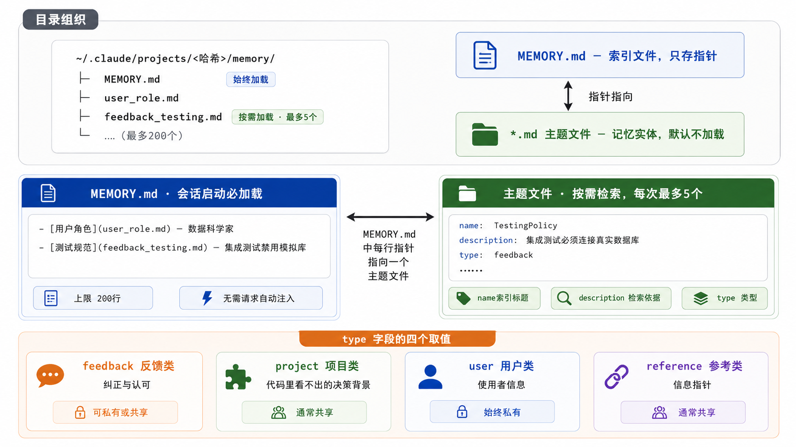
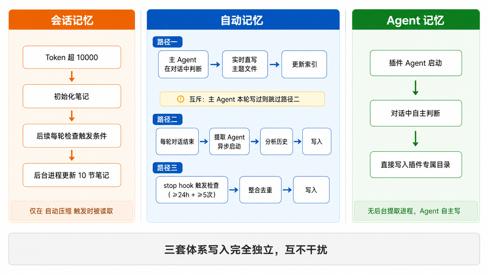
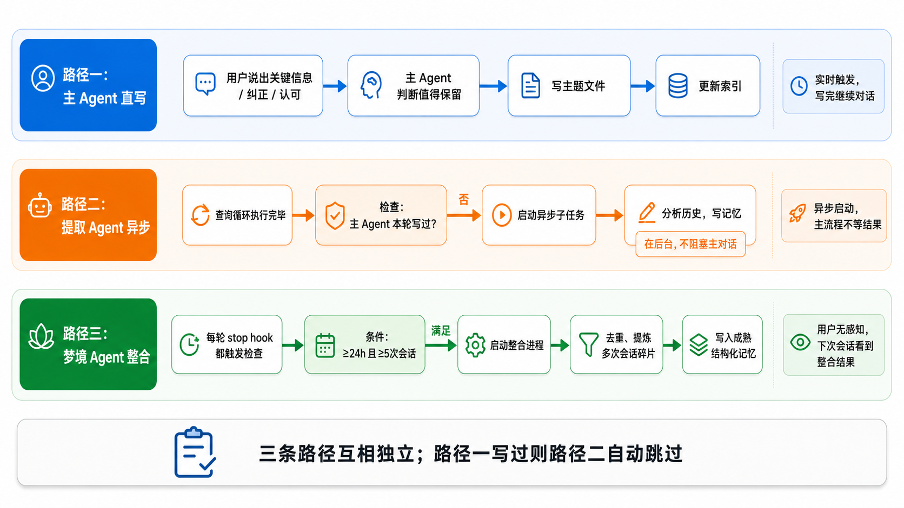
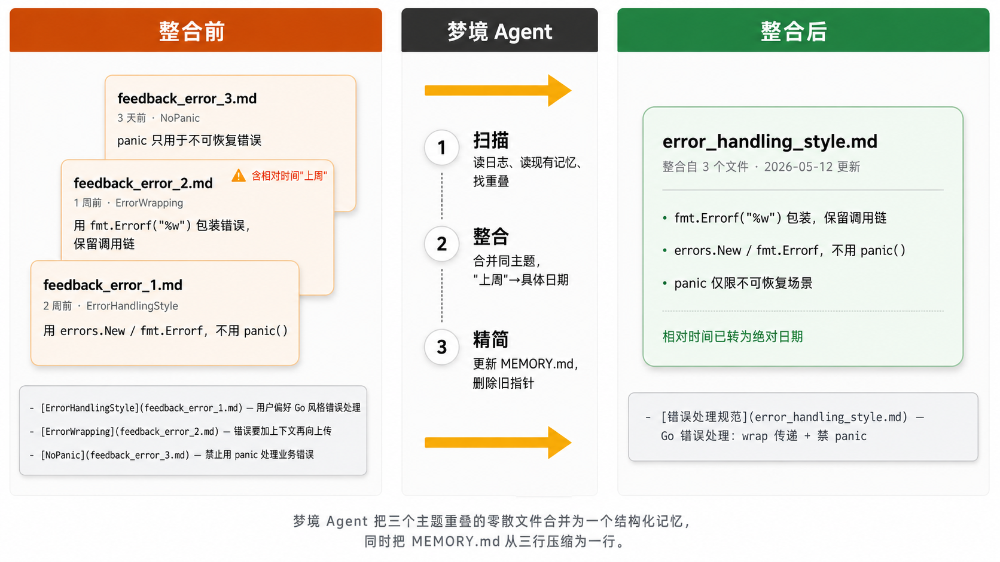
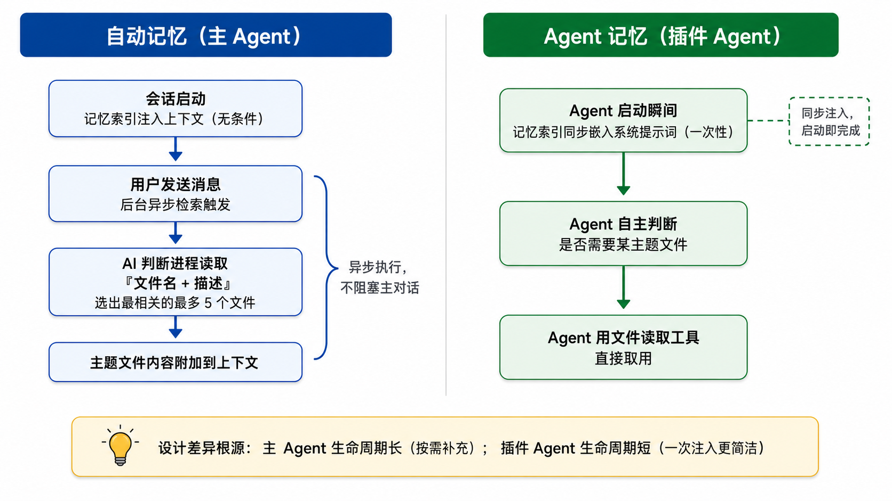

# Claude Code 记忆系统（完整样例）

> **用途**：这是用本 skill 完成的真实输出样本（Mode B · R2 读者 · 架构源码深挖型），可以直接参考其结构、画图提示写法、行文风格和示例组织方式。
>
> **图示说明**：每个画图提示代码块后若紧跟 `` 标签，表示已有对应渲染图；无 `` 的画图提示为待渲染占位，两者均可参考其写法。

---

# 一、前言

对话结束，模型归零。

这是所有 LLM Agent 的根本限制：每次会话相互隔离，不保留任何记忆。用户上次纠正的错误、项目里达成的约定、调试了三天才搞清楚的边界条件——如果没有主动持久化，下次启动一切从头来过。

Claude Code 为此构建了**三套记忆体系**，分别解决三个不同维度的问题：

- **会话记忆**：对话进行中持续更新的实时草稿，在自动压缩触发时顶替临时摘要，用完即清理，不跨会话
- **自动记忆**：以项目路径为键的长期积累，记住用户偏好、项目决策、历史纠错，跨会话永久保留
- **Agent 记忆**：以 Agent 类型为键的插件专属知识，随插件跨项目携带，Agent 启动时自动注入

三套体系的**生命周期、写入者、读取时机**各不相同，容易混淆。本文从存储结构出发，依次拆解每套体系的写入逻辑与读取时机。


# 二、三套记忆体系总览

Claude Code 的三套记忆体系解决的是三个完全不同的问题，生命周期、写入者、读取时机都不一样——放在一起容易混，先看清楚区别：

```
# 画图提示：三栏横向对比图，对比三套记忆体系的本质差异。
#
# ──────────────────────────────────────────────
# 整体布局
# ──────────────────────────────────────────────
# 三列等宽，列间用细灰色竖线分隔，无外边框。
# 每列由顶部「标题栏」+ 四行「属性卡片」+ 底部「汇总栏」构成。
# 白色背景，字体无衬线，整体风格参考高质量技术 PPT 配图。
#
# ──────────────────────────────────────────────
# 顶部标题栏（每列独立颜色，深色实色背景，白色文字）
# ──────────────────────────────────────────────
# 左栏：深蓝色背景
#   主标题（粗体大字）：会话记忆
#   副标题（细体小字，主标题下方）：后台异步任务 · 按会话
#
# 中栏：深绿色背景
#   主标题：自动记忆
#   副标题：主 Agent · 按项目
#
# 右栏：深紫色背景
#   主标题：Agent 记忆
#   副标题：插件 Agent · 按类型
#
# ──────────────────────────────────────────────
# 四行属性卡片（每张卡片：圆角矩形，浅色背景，内边距均匀）
# 卡片内布局：左侧「属性名」粗体彩色（同列主色调）+ 右侧「属性值」普通黑色文字
# ──────────────────────────────────────────────
#
# 第一行【目的】
#   左卡片：为当次对话的自动压缩提速
#   中卡片：跨会话保留项目决策与用户偏好
#   右卡片：跨项目共享插件 Agent 专属知识
#
# 第二行【生命周期】—— 文字右侧附小图标
#   左卡片：单次会话，结束即清理
#     图标：一条水平细线，末端加竖线截止符（→|），表示"有终点"
#   中卡片：永久持久化，跨会话累积
#     图标：顺时针双箭头循环圆（↻），表示"持续积累"
#   右卡片：永久持久化，跨项目共享
#     图标：同上循环圆（↻）
#
# 第三行【写入者】
#   左卡片：后台异步任务，自动定期触发
#   中卡片：三条路径——主 Agent 直写 · 提取 Agent 异步 · 梦境 Agent 整合
#   右卡片：插件 Agent 自主判断写入，无后台辅助进程
#
# 第四行【读取时机】
#   左卡片：自动压缩触发瞬间 → 一次性读入替换旧历史
#   中卡片：每次用户发消息 → 后台异步检索最多 5 个主题文件
#   右卡片：插件 Agent 启动瞬间 → 同步注入完整索引
#
# ──────────────────────────────────────────────
# 底部汇总栏（横跨三列，浅灰色背景，圆角矩形）
# ──────────────────────────────────────────────
# 居中正文：
# 三套体系文件格式相同（记忆索引 + 主题文件），但存储位置、生命周期、读写节拍各异
```

| 维度 | 会话记忆 | 自动记忆 | Agent 记忆 |
|------|---------|---------|-----------|
| 解决什么问题 | 自动压缩触发时不从头生成摘要 | 跨会话记住项目决策和用户偏好 | 跨项目共享插件 Agent 的专属知识 |
| 生命周期 | 单次会话，结束即清理 | 永久，跨会话累积 | 永久，跨项目共享 |
| 谁写入 | 后台异步任务 | 主 Agent / 提取 Agent / 梦境 Agent | 插件 Agent 自己 |
| 读取时机 | 自动压缩触发时一次性读入 | 每次用户发消息时，后台异步检索 | 插件 Agent 启动瞬间同步注入 |
| 存储键 | 会话 ID | 项目路径 | Agent 类型名 |

> 自动记忆和 Agent 记忆是"长期记忆"——跨会话持久存在，下次打开还在；会话记忆是"工作草稿"——只服务当次对话，用完即弃。

## 2.1 会话记忆：对话期间的实时笔记

笔记存储在 `~/.claude/projects/<路径>/<sessionId>/session-memory/summary.md`，以**会话 ID** 为键，每次启动新对话都从空白文件开始。对话进行中由**后台异步任务**持续更新，自动压缩触发时直接替换旧历史，省去临时生成摘要的约**两秒**等待。

会话结束后，这份笔记不再被读取——它的使命只是服务当次对话，用完即弃。

以一次实际对话为例。对话进行到一半，触发自动压缩：

> 任务：给 auth 模块补集成测试。单元测试已经写完，现在卡在数据库 mock 上——`conftest.py` 里的 `db_session` 事务隔离还没跑通，`/api/login` 端点的集成测试还没开始。

这时 `session-memory/summary.md` 大致长这样：

```markdown
# 会话标题
给 auth 模块补集成测试

# 当前状态
正写集成测试；下一步测 /api/login；conftest.py 里 db_session 事务隔离未完成

# 任务规格
为 auth 模块新增单元测试和集成测试，需覆盖登录、注册、令牌刷新三个端点

# 文件与函数
- tests/test_auth.py：认证单元测试主文件（已完成）
- tests/conftest.py：fixtures 配置，db_session 事务隔离问题待解

# 错误与纠正
- 错误：async 函数里用 pytest.raises() 捕获不到
- 正确：改成 async with pytest.raises()

# 工作日志
① 建 test_auth.py 骨架 ② 写 register/login 单元测试（通过）③ 尝试 mock 数据库 → 失败，改用测试数据库实例
```

AI 从**当前状态**一章接续工作，不需要回头看几十轮对话历史。笔记按**十个固定章节**组织，每章各司其职：

| 章节 | 记录内容 | 在这个场景里记什么 |
|------|---------|-------------------------|
| **会话标题** | 5 到 10 个词描述这次会话在做什么 | 「给 auth 模块补集成测试」 |
| **当前状态** | 现在正在做什么？哪些任务挂起中？下一步是什么？ | 「已完成单元测试，正写集成测试；下一步测 `/api/login`；数据库 mock 还没跑通」 |
| **任务规格** | 用户让你做什么？有哪些设计决策和背景说明？ | 「为 auth 模块新增单元测试和集成测试，需覆盖登录、注册、令牌刷新三个端点」 |
| **文件与函数** | 重要的文件有哪些？它们包含什么、为什么相关？ | 「`tests/test_auth.py` 单元测试；`tests/conftest.py` 配置 fixtures，其中 `db_session` 事务隔离未完成」 |
| **工作流** | 通常跑哪些命令，顺序是什么？输出怎么解读？ | 「`pytest tests/test_auth.py -v` 跑认证测试；`pytest --cov` 看覆盖率；失败时先看 FAILED 行定位」 |
| **错误与纠正** | 遇到了什么错误，怎么修复的？什么路径走不通？ | 「异步函数里用 `pytest.raises()` 捕获不到，改成 `async with pytest.raises()` 才生效」 |
| **代码库与系统文档** | 重要的系统组件是什么？它们如何协作？ | 「auth 模块依赖 `UserRepository`（数据库操作）和 `TokenService`（令牌签发验证），测试需同时处理两者」 |
| **经验总结** | 什么有效？什么无效？要避免什么？ | 「用真实测试数据库比 mock 可靠；fixture 里不要共享数据库连接，事务隔离会出问题」 |
| **关键结果** | 用户要求的具体输出（表格、答案），在这里完整保留 | 「测试覆盖率：auth 模块 87%，login 100%、register 92%、token_refresh 74%」 |
| **工作日志** | 每一步做了什么的简短流水账 | 「① 建 `test_auth.py` 骨架 ② 写 register/login 单元测试（通过）③ 尝试 mock 数据库 → 失败，改用测试数据库实例」 |

> 每节有约 **2,000 Token** 的软上限，整个笔记总上限约 **12,000 Token**（约 24,000 个字符）。自动压缩触发时，这份笔记直接替换旧历史，AI 从**当前状态**一章记录的位置接续工作，不丢失上下文。

以会话 ID 为键意味着：每开一次新对话，就是一块新白板，不受上次会话笔记的影响。这是会话记忆刻意选择的轻量设计——与此对应，自动记忆以项目路径为键，在会话之间持续累积，承担的是完全不同的职责。

---

## 2.2 自动记忆：按项目隔离，主 Agent 持有

自动记忆存储在 `~/.claude/projects/<项目路径>/memory/` 下，以项目路径为键，不同项目的记忆完全隔离。格式由两类文件组成：始终加载的索引和按需取出的主题文件，每条记忆带一个四选一的类型标签。

```
# 画图提示：自动记忆存储结构（目录树 + 双列文件说明 + 四类型标签）
#
# 整体布局：三行纵向
# 顶行：目录树（代码块风格）
# 中行：左右两栏（MEMORY.md 索引 | 主题文件）
# 底行：四种 type 类型标签
#
# 顶行【目录结构】（浅灰背景代码块样式）：
#   ~/.claude/projects/名称/memory/
#   ├── MEMORY.md         ← 索引文件，始终加载
#   ├── user_role.md
#   ├── feedback_testing.md
#   └── ...（最多 200 个）
#
# 中行左栏【MEMORY.md · 会话启动必加载】（浅蓝背景圆角卡片）：
#   右上角标注：「始终注入上下文」
#   内容：三行索引示例（[名称](文件名) — 摘要）
#   底部：「上限 280 行条目」
#
# 中行右栏【主题文件 · 按需检索，每次最多 5 个】（浅橙背景圆角卡片）：
#   内容：示例主题文件头部（name / description / type / 正文）
#   右侧小标注：「AI 判断进程只读 description 选文件」
#
# 底行【四种类型】（横排四个彩色小卡片）：
#   反馈类（蓝）纠正与认可 | 项目类（绿）代码查不到的背景
#   用户类（橙）使用偏好   | 参考类（紫）信息指针地图
#
# 白色背景，全部中文标注
```



### 2.2.1 索引文件 MEMORY.md：每次会话都加载的目录

`MEMORY.md` 是自动记忆的**入口**。每次会话启动，这份文件**无条件全量注入** AI 的上下文——不需要检索，不需要请求，AI 从第一条消息起就知道"我有哪些记忆可以用"。

它不存记忆内容本身，只存一份**指针目录**——每行一条，指向记忆目录里的一个主题文件，并附上一句摘要：

```
- [用户角色](user_role.md) — 数据科学家，关注可观测性和日志系统
- [测试规范](feedback_testing.md) — 集成测试必须用真实数据库，禁止模拟；源于上季度线上事故
- [移动端发版计划](project_mobile_release.md) — 发版截止 2026-05-08，此后禁合并非关键改动
- [外部系统地图](reference_systems.md) — Linear 的 INGEST 项目跟踪流水线问题，Grafana 看板地址
```

每行由三部分组成，直接取自主题文件的字段，不额外做二次总结：

| 示例 | 来源 | 作用 |
|------|------|------|
| `[测试规范]` | 主题文件的 `name` 字段 | 让 AI 知道这条记忆叫什么 |
| `(feedback_testing.md)` | 主题文件的实际路径 | AI 取文件时的定位依据 |
| `— 集成测试必须用真实数据库…` | 主题文件的 `description` 字段 | 让 AI 判断是否需要取出完整文件 |

### 2.2.2 主题文件：记忆的实际内容

每条记忆单独存一个 `.md` 文件（如 `feedback_testing.md`、`user_role.md`）。**这些文件默认不加载**，只有当 AI 判断它和当前问题相关时，才会被取出来——每次最多取 5 个，附加到上下文里。

每个主题文件结构固定，由两部分组成：

| 字段 | 作用 |
|------|------|
| **name** | 记忆的短标题，出现在 MEMORY.md 的索引行里 |
| **description** | **检索的核心依据**：AI 判断要取哪几个主题文件时，只看这一句描述决定"要不要取这个文件"——越具体越好，「一些项目笔记」几乎永远不会被选中，「移动端发版合并窗口从 2026-05-08 起关闭」则会在相关问题出现时被精准命中 |
| **type** | 四选一的分类标签，决定这条记忆的性质与落盘位置（见下节） |
| **正文** | 实际的记忆内容，自由格式 Markdown，AI 取到这个文件后读的就是这里 |

以测试规范这条记忆为例：

```
---
name: TestingPolicy
description: 集成测试必须连接真实数据库，禁止模拟数据库；源于上季度生产事故
type: feedback
---

规则：所有集成测试必须连接真实的测试数据库，不允许使用模拟数据库。

原因：上季度发生了一次线上事故。模拟测试全部通过，但生产环境迁移失败——因为模拟数据库和真实数据库对某个边界情况的处理行为不同。

如何应用：任何时候看到测试文件里有模拟数据库的写法，必须提醒修改。新写集成测试时主动选择真实数据库连接。
```

### 2.2.3 四种记忆类型：type 字段的四个取值

`type` 字段有四个取值，AI 根据内容性质自动判断并决定落盘位置，用户无需手动指定：

| 类型 | 记什么 | 典型场景 | 是否共享 |
|------|--------|---------|---------|
| `feedback` | 用户对 AI 行为的纠正与认可 | "集成测试必须用真实数据库" | 个人偏好存私有目录，团队约定存项目目录 |
| `project` | 代码里看不出的决策背景 | "本次重构是合规要求，非技术债" | 通常存项目目录（内容是整个项目相关的，团队都需要知道） |
| `user` | 用这个工具的人是谁 | "Go 十年经验，刚接触 React" | 固定存私有目录（内容只和这个人相关，不应让团队看到） |
| `reference` | 去哪里找信息的指针 | "流水线问题在团队任务管理工具的摄取（INGEST）项目" | 通常存项目目录（内容是整个项目相关的，团队都需要知道） |

四个取值各有侧重：`feedback` 和 `user` 回答「和谁协作、如何协作」，`project` 和 `reference` 回答「在什么背景下工作」——合在一起，构成一个项目里 AI 需要持续记住的完整工作上下文。

---

## 2.3 Agent 记忆：按 Agent 类型隔离，跨项目共享

自动记忆以项目为范围，记住的是整个团队的工作上下文；Agent 记忆以 **Agent 类型名**为键，记住的是某类插件工具的专属知识，同一类 Agent 无论在哪个项目里被调用，都共享同一套记忆目录。装了插件、用过一次之后，该 Agent 就有了记忆，下次在另一个项目里启动时带着相同的知识开始工作。

> **什么是 Agent 类型名？** 一个插件可以包含多个扮演不同角色的 Agent，每类在插件里有一个声明好的名称。类型名就是 `插件名:Agent名` 的组合，例如 `my-plugin:code-reviewer`，这个字符串即为存储键。

文件格式与自动记忆完全相同（`MEMORY.md` 索引 + 主题文件），但有两个独有设计：**三层存储范围，以及快照机制。**

### 2.3.1 三层存储范围

Agent 记忆有三个不同的存储层，对应不同的共享范围：

```
# 画图提示：Agent 记忆三层存储范围（从宽到窄的嵌套层级图）
#
# 整体布局：三层从外到内嵌套，范围从大到小，像俄罗斯套娃
#
# 最外层【用户级】（最宽，浅蓝背景）：
#   路径：~/.claude/agent-memory/<类型名>/
#   标注：跨所有项目可见 · 仅当前用户
#   适合：跨项目通用偏好（如代码风格偏好、回复语言）
#   右侧图标：单人轮廓
#
# 中间层【项目级】（次宽，浅绿背景）：
#   路径：.claude/agent-memory/<类型名>/
#   标注：可提交版本库 · 团队共享
#   适合：项目约定（如分支命名规范、测试策略）
#   右侧图标：多人轮廓
#
# 最内层【本地级】（最窄，浅橙背景）：
#   路径：.claude/agent-memory-local/<类型名>/
#   标注：不进版本库 · 仅本机有效
#   适合：本机私有配置（如本地数据库地址、密钥位置）
#   右侧图标：电脑/本地设备
#
# 底部说明：「Agent 根据信息性质决定写入哪一层」
# 白色背景，全部中文标注
```

| 范围 | 路径 | 适合存什么 |
|------|------|-----------|
| 用户级 | `~/.claude/agent-memory/<类型名>/` | 跨所有项目的通用偏好，只有你自己能看到 |
| 项目级 | `.claude/agent-memory/<类型名>/` | 这个项目专属的知识，可以提交到版本库让团队共享 |
| 本地级 | `.claude/agent-memory-local/<类型名>/` | 本机私有设置（如本地路径、密钥位置），不进版本库 |

> 写到哪一层由 Agent 自己根据内容性质判断：只和当前用户相关的存用户级，项目全员都需要知道的存项目级，本机特有的路径或密钥位置存本地级。

### 2.3.2 快照机制：预置初始记忆

插件作者可以在插件包里随附一批初始记忆文件，存放在 `.claude/agent-memory-snapshots/<类型名>/` 目录，让插件从第一次被调用起就带着预置知识，不需要从零积累。

快照是否介入，由"同步状态"决定。本地记忆目录里有一个 `.snapshot-synced.json` 文件，记录上次同步时快照的时间戳。每次 Agent 启动时，Claude Code 都会比较这个时间戳和快照包里的最新时间戳——匹配则视为已同步，快照不再介入；不匹配则触发同步流程。

具体来说，快照在两种情况下会介入：

- **首次安装**：用户刚装上插件，本地目录是空的（没有 `.snapshot-synced.json`）。Claude Code 自动把快照里的记忆文件复制到本地，并写入 `.snapshot-synced.json` 记录时间戳，之后就不再读快照。
- **快照更新**：插件作者发布了新版本（快照包里的时间戳更新了），本地的 `.snapshot-synced.json` 记录的是旧时间戳——两者不匹配，Claude Code 通知 Agent "有新的快照可用"，由 Agent 决定是否采纳更新，更新后写入新时间戳。

一旦本地时间戳和快照时间戳匹配，快照不再介入。之后 Agent 自己积累的记忆完全独立运行，不受快照影响。

---

# 三、写入与提取：信息是怎么进入记忆系统的

三套记忆体系写入机制各不相同：

```
# 画图提示：横向三列对比图，展示三套体系各自写入路径的全貌。
#
# 整体布局：三列并排，从左到右代表三套体系；每列内部纵向排列写入流程；列间用竖线分隔。
#
# 列 1【会话记忆】（浅橙背景列）：
#   顶部体系名标签（深橙横条）：「会话记忆」
#   纵向流程（从上到下）：
#     Token 超 10000 → 初始化笔记
#     → 后续每轮检查触发条件
#     → 后台进程更新 10 节笔记
#   底部加注：「仅在 自动压缩 触发时被读取」
#
# 列 2【自动记忆】（浅蓝背景列）：
#   顶部体系名标签（深蓝横条）：「自动记忆」
#   列内纵向三行，各行一条路径：
#     行 1「路径一」：主 Agent 在对话中判断 → 实时直写主题文件 → 更新索引
#     行 2「路径二」：每轮对话结束 → 提取 Agent 异步启动 → 分析历史 → 写入
#     行 3「路径三」：stop hook 触发检查（≥24h + ≥5次）→ 整合去重 → 写入
#   仅在「路径一」和「路径二」之间标注：「互斥：主 Agent 本轮写过则跳过路径二」
#
# 列 3【Agent 记忆】（浅绿背景列）：
#   顶部体系名标签（深绿横条）：「Agent 记忆」
#   纵向流程（从上到下）：
#     插件 Agent 启动 → 对话中自主判断 → 直接写入插件专属目录
#   底部加注：「无后台提取进程，Agent 自主写」
#
# 底部横跨三列说明框：「三套体系写入完全独立，互不干扰」
# 白色背景，全部中文标注
```



三套体系的写入机制各不相同：

1. **会话记忆**：专用后台进程，在对话进行中持续更新笔记文件，主对话完全无感知
2. **自动记忆**：三条写入路径——主 Agent 实时直写、提取 Agent 每轮结束后异步补写、梦境 Agent 定期跨会话整合
3. **Agent 记忆**：插件 Agent 自主判断、自主写入，无后台辅助进程

## 3.1 会话记忆：每轮采样后的后台更新

会话记忆的写入以 hook 的方式挂在对话主循环上——**每次模型响应后立即触发**。整个写入过程在后台异步执行，不阻塞主流程。

### 3.1.1 触发条件

每次触发时，依次检查两类条件：

| 阶段 | 前提（必须满足） | 附加条件 A（OR） | 附加条件 B（OR） |
|------|---------------|----------------|----------------|
| **初始化**（文件不存在） | 上下文 Token 首次超过 **10,000**（过滤短对话，不做无意义写入） | — | — |
| **持续更新**（文件已存在） | 上下文增长 ≥ **5,000 Token** | 工具调用次数 ≥ **3**（AI 做了实质操作，值得记录） | 本轮无工具调用（AI 只回了文字、没执行任何操作，作为自然停顿点兜底，防漏记） |

两类条件都不满足时，这次更新直接跳过，什么都不做。

>  用户也可以随时执行 `/summary` 命令，手动触发即时更新，绕过所有阈值检查。

### 3.1.2 每次更新写什么

触发后，系统启动一个**后台异步任务**，把当前 `summary.md` 的完整内容和完整的对话历史一起发给 LLM，附上一份结构化的更新提示词。对话历史包含截止当前响应的所有消息，包括之前各轮的工具调用和工具结果；本轮工具结果尚未执行，不在传入范围内。提示词按**十个章节**逐一规定"这个章节应该记什么、怎么更新"，任务据此决定每个章节是**保留、追加还是改写**，结果直接覆写 `summary.md`。

| 章节 | 模板描述（翻译自源码） | 更新行为 | 说明 |
|------|----------------------|---------|------|
| **会话标题** | 5–10 词的简短独特描述，高度信息密度，无废话 | AI 自判 | — |
| **当前状态** | 当前正在做什么？未完成的挂起任务？紧接的下一步？ | **改写** | 源码明确每次必须更新；自动压缩把旧历史清掉后，AI 靠这一节找回"现在在干什么、下一步做什么" |
| **任务规格** | 用户让你做什么？有哪些设计决策或背景说明？ | AI 自判 | — |
| **文件与函数** | 重要文件有哪些？简述其内容及相关原因 | AI 自判 | — |
| **工作流** | 通常跑哪些 bash 命令？顺序如何？输出如何解读？ | AI 自判 | — |
| **错误与纠正** | 遇到了哪些错误及修复方法？用户纠正了什么？哪些路径走不通不应再试？ | **追加** | 笔记超过 12,000 Token 上限需压缩时，与「当前状态」并列优先保留，其他节可删减 |
| **代码库与系统文档** | 重要的系统组件是什么？它们如何协作？ | AI 自判 | — |
| **经验总结** | 什么有效？什么无效？要避免什么？ | AI 自判 | 源码明确：不与其他章节重复 |
| **关键结果** | 若用户要求具体输出（表格、答案等），在此完整保留 | AI 自判 | — |
| **工作日志** | 逐步记录尝试了什么、做了什么，每步极简概括 | **追加** | — |

> 子进程**只执行 Edit 工具调用**——一条消息里并行提交所有改动，把 API 调用轮次压到最低。没有实质新信息的章节直接跳过，不做任何写入。

以一次实际对话为例，看子进程在同一轮如何处理全部十个章节。

> **场景**：用户让 AI 帮写一个日志分析脚本。前几轮完成了文件读取和时间解析。本轮 AI 写了关键词过滤代码，用户跑起来后反馈报错——AI 之前猜日志是 JSON 格式，实际是纯文本、每行一条，解析方式完全不对。AI 修正了代码，同时完成了关键词过滤。

本轮触发更新前，**当前状态**节的内容是：

```
正在实现关键词过滤；日志格式待确认
```

本轮子进程只更新了三个章节，其余七章无实质变化，直接跳过：

| 章节 | 本轮操作 | 改后内容 |
|------|---------|---------|
| **当前状态** | **改写** | 关键词过滤已完成（支持正则匹配）；日志格式已确认为纯文本每行一条；下一步做统计汇总 |
| **错误与纠正** | **追加** | 错误：将日志当成 JSON 解析，用户运行后报错；正确：日志是纯文本，每行一条，应按行读取；下次遇到未知格式，先让用户确认再写解析代码 |
| **工作日志** | **追加** | ③ 修正日志解析方式（纯文本逐行），完成关键词过滤，支持正则匹配 |

### 3.1.3 效果：压缩延迟从 2 秒降至 0.1 秒

搞清楚了写什么、怎么触发，再来看这套机制带来的实际效果。传统自动压缩在上下文接近上限时才临时生成摘要，会阻塞对话约 2 秒；有了持续更新的会话记忆，压缩时直接读取现成笔记，延迟降至 0.1 秒。

```
# 画图提示：自动压缩延迟对比（左右并排时序图）
#
# 整体布局：左右两列，中间竖线分隔，无外边框
#
# 左列【传统流程】（浅红/浅橙背景）：
#   列标题：传统流程
#   纵向步骤（自上而下，圆角矩形节点）：
#     ① 对话进行中（上下文持续累积）
#     ② 上下文接近上限，触发压缩
#     ③ 临时读取全部历史
#     ④ 调用模型生成摘要 ← 红色高亮节点，右侧红色标注「阻塞 ≈ 2 秒」
#     ⑤ 压缩完成，对话继续
#
# 右列【会话记忆流程】（浅绿背景）：
#   列标题：会话记忆流程
#   纵向步骤（自上而下）：
#     ① 对话进行中（后台同步更新笔记）← 灰色虚线框，注「用户无感知」
#     ② 上下文接近上限，触发压缩
#     ③ 直接读取现成笔记文件
#     ④ 压缩完成，对话继续 ← 绿色高亮节点，右侧绿色标注「延迟 ≈ 0.1 秒」
#
# 底部横跨两列对比标注：「2 秒 → 0.1 秒，降幅 95%」
# 白色背景，全部中文标注
```

图中左侧是传统流程：上下文接近上限时，临时读取全部历史生成摘要，第④步产生约 2 秒的阻塞；右侧是会话记忆流程：笔记在对话中持续更新，压缩触发时直接读取现成笔记，延迟压缩到 0.1 秒。

> 会话记忆把压缩延迟从 **2 秒**降到了 **0.1 秒**——这份持续更新的笔记，就是之后自动压缩触发时 AI 恢复工作状态的起点。

会话记忆的写入由专用后台进程全程负责，不需要主对话参与任何判断；自动记忆的写入则不同——它需要 AI 主动识别哪些信息值得留存、以哪种类型落盘。

---

## 3.2 自动记忆：三条写入路径

三条路径按写入时机分层，互相配合不重叠：

```
# 画图提示：三行纵向流程图，展示自动记忆三条写入路径的时机与关系
#
# 整体布局：纵向三行，每行一条路径；每行内部是横向时序节点（从左到右）
#
# 行一【路径一：对话中】（浅蓝背景行）：
#   左侧路径名标签：「路径一：主 Agent 直写」
#   横向节点：「用户说出关键信息 / 纠正 / 认可」→「主 Agent 判断值得保留」→「写主题文件」→「更新索引」
#   右侧注：「实时触发，写完继续对话」
#
# 行二【路径二：轮次结束】（浅橙背景行）：
#   左侧路径名标签：「路径二：提取 Agent 异步」
#   横向节点：「查询循环执行完毕」→「检查：主 Agent 本轮写过？」→（两条分支）
#     否 → 「启动异步子任务」→「分析历史，写记忆」（在后台，标注「不阻塞主对话」）
#   右侧注：「异步启动，主流程不等结果」
#
# 行三【路径三：每轮 stop hook，条件满足才实际运行】（浅绿背景行）：
#   左侧路径名标签：「路径三：梦境 Agent 整合」
#   横向节点：「每轮 stop hook 都触发检查」→「条件：≥24h 且 ≥5次会话」→（两条分支）
#     满足 → 「启动整合进程」→「去重、提炼多次会话碎片」→「写入成熟结构化记忆」
#   右侧注：「用户无感知，下次会话看到整合结果」
#
# 三行之间用细横线分隔
# 底部横跨三行说明框：「三条路径互相独立；路径一写过则路径二自动跳过」
# 白色背景，全部中文标注
```



| 路径 | 执行者 | 触发时机 | 运行条件 | 特点 |
|------|-------|---------|------------|------|
| 路径一 | 主 Agent | 用户消息含值得保存的信息时 | — | 从当前对话直接写入，主 Agent 自主判断，无中间层 |
| 路径二 | 后台提取 Agent | 每轮查询结束后 | 主 Agent 本轮未写入记忆 | 重新分析本轮对话历史，专门提取主 Agent 跳过的信息 |
| 路径三 | 梦境 Agent | 每轮查询结束后 | 扫描间隔 ≥ **10min** + 距上次 ≥ **24h** + 独立会话 ≥ **5** 次 + 无并发锁 | 读取已有记忆文件（非对话历史），跨会话去重整合提炼 |

### 3.2.1 路径一：主 Agent 在对话中直接写

主 Agent 的系统提示词里始终包含完整的记忆保存指令——每次对话它都知道该怎么识别和保存信息。当它在对话过程中判断"这个信息值得保留"，就立刻动手写文件，不等对话结束。

触发这条路径的典型时机：

- 用户明确说"帮我记住这件事"
- 用户纠正了 AI 的某个做法（"不要这样，要那样"）
- 用户认可了 AI 某个不太显然的选择（"对，就这样"）
- 用户说出了关键的背景信息（截止日期、负责人、决策原因）

每次识别到值得保存的信息，主 Agent 立刻执行两步写入：先创建独立主题文件，再在 `MEMORY.md` 索引里追加一行指针（摘要控制在约 **150 个字符**以内，避免索引条目过长撑爆加载上限）。以一条测试规范反馈为例：

> "这几个集成测试不要用模拟数据库，上季度就是因为这个翻车的——模拟通过了，生产环境直接挂。"

创建 `feedback_testing_policy.md`：

```
---
name: TestingPolicy
description: 集成测试必须连接真实数据库，禁止使用模拟数据库
type: feedback
---

规则：所有集成测试必须连接真实的测试数据库，不允许使用模拟数据库。

原因：上季度生产事故——模拟测试全部通过，但真实数据库对某个边界情况的处理方式不同，上线后直接挂了。

如何应用：发现测试里有模拟数据库写法时必须提示修改；新写集成测试时主动选择真实数据库连接。
```

在 `MEMORY.md` 追加一行：

```
- [测试规范](feedback_testing_policy.md) — 集成测试必须连真实数据库，禁止模拟，源于上季度生产事故
```

> 写完后 AI 继续对话，用户有时会看到界面提示"已保存 1 条记忆"。

触发写入的信息，按内容性质分为四类，对应 `type` 字段的四个取值：

#### 3.2.1.1 反馈类（feedback）——纠正与认可都要记

反馈类记录的是用户对 AI 行为的态度，分两类触发：纠正和认可。

**纠正**——用户明确否定或更正 AI 的做法，包括行为纠错和风格偏好：

> "别在每条回复结尾加总结了，我自己能看改了什么。"

```markdown
---
name: NoSummaryFooter
description: 不要在回复末尾加总结段落
type: feedback
---

规则：回复结尾不加"总结"或"小结"段落。

原因：用户能自己看清楚改动内容，总结是多余的噪音。
```

**认可**——用户对 AI 某个不太显然的选择表示认同：

> "对，把这次重构打成一个大的合并请求（PR）是对的，拆开的话只会多造麻烦。"

```markdown
---
name: LargeRefactorStrategy
description: 大型重构倾向于合并成单个代码提交，不拆分
type: feedback
---

规则：大型重构合并为单个 PR，不拆成多个小 PR。

原因：用户认为拆分增加协调成本，且这次已验证单 PR 方式可行。
```

> 为什么认可也要记？只记纠正会让 AI 越来越保守——只知道哪里失败了，不知道哪些判断已被验证过。源码提示词特别指出：**纠正容易注意到，认可更安静——要主动留意**。

反馈类记忆的正文结构是"规则 → 为什么 → 如何应用"，其中"为什么"是关键：知道原因，AI 才能在边界情况下自己判断要不要遵守规则，而不是机械执行。

#### 3.2.1.2 项目类（project）——代码里查不到的背景

项目类记忆保存"代码本身看不出来、但会影响后续决策"的背景信息。

> "周四之后所有非关键改动都要冻结——移动端在切发版分支。"

```markdown
---
name: MergeFreeze
description: 2026-03-05 起合并冻结，原因是移动端发版；遇到代码合并工作需提示用户
type: project
---

状态：2026-03-05 起主分支合并窗口关闭，仅接受关键 bug 修复。

原因：移动端正在切发版分支，冻结期间合并可能引入不稳定因素。

如何应用：用户提到代码合并或分支操作时，主动提示当前处于冻结期。
```

> 注意 AI 在保存时把"周四"换成了具体日期。这是一个硬规定——项目信息变化快，相对时间两周后就失效，绝对日期永远可读。

> "我们把老的认证中间件拆掉，是因为法务说那套存会话令牌的方式不符合新的合规要求，不是为了清技术债。"

```markdown
---
name: AuthRefactorReason
description: 认证中间件重写的驱动力是合规要求而非技术债；方案决策应优先满足合规
type: project
---

背景：老的认证中间件存储会话令牌的方式不符合新合规要求（法务确认），这是本次重写的唯一驱动力。

如何应用：涉及认证相关的设计决策时，优先级顺序是合规 > 性能 > 代码整洁度。
```

> 这个背景代码里完全看不出来，但它会影响接下来所有相关的设计判断，非常值得保存。

#### 3.2.1.3 用户类（user）——认识使用这个工具的人

用户类记忆回答一个问题："和我对话的这个人是谁，我应该怎么和他说话"。

> "我是数据科学家，在查这个系统的日志覆盖情况。"

```markdown
---
name: UserBackground
description: 数据科学家，当前关注可观测性和日志系统；相关问题不需要从基础讲起
type: user
---

职业背景：数据科学家，熟悉 Python 数据生态。

当前关注：系统的可观测性和日志覆盖情况。

沟通方式：不需要解释基础概念，可以直接用技术术语。
```

> "我写 Go 写了十年，但这是我第一次碰这个项目的 React 部分。"

```markdown
---
name: UserSkillLevel
description: Go 经验深，React 是新手；解释前端概念时用后端类比建立映射
type: user
---

技术背景：Go 开发十年经验，熟悉后端系统设计。

当前短板：React 和前端开发是新领域。

沟通策略：解释前端概念时用 Go 类比（如：React 组件 ≈ Go 结构体 + 方法集）。
```

> 这两个例子的共同点是：AI 不是记了一堆标签，而是记了"这个信息如何改变我的行为"。数据科学家背景意味着解释方式不同；Go 老手 React 新手意味着要用 Go 的概念来类比。

两个边界：不保存对用户的负面评价；不保存与工作无关的个人信息。用户类记忆始终私有，不会同步给团队——它描述的是这个具体的人，不是项目本身。

#### 3.2.1.4 参考类（reference）——去哪里找信息的地图

参考类存的是"指针"，不是内容本身——它不解释某件事，只告诉 AI 去哪里找那件事。

> "想了解这些工单的背景，去任务管理工具的摄取（INGEST）项目看——流水线相关的问题都在那里跟踪。"

```markdown
---
name: PipelineTickets
description: 流水线问题在团队任务管理工具的摄取（INGEST）项目下跟踪
type: reference
---

位置：团队任务管理工具 → 摄取（INGEST）项目。

用途：流水线相关的问题、缺陷、改进需求都在此处跟踪，涉及流水线时优先查这里。
```

> 通用的命令或做法随时能搜到，不值得存。只有团队内部才知道、外人加入不告诉他就找不到的位置信息，才适合保存为参考类记忆。

#### 3.2.1.5 什么不该保存

自动记忆的设计原则只有一条——**只保存代码库和版本记录无法替代的信息**。能从代码推导的、`git log` 能查的、已经在 `CLAUDE.md` 里写过的，一律不存。

| 内容 | 为什么不存 | 去哪查 |
|------|-----------|--------|
| 代码规范、风格约定 | 看代码本身就知道 | 直接读代码库 |
| 版本提交历史 | 会过期，工具比记忆准 | `git log` |
| 已在 `CLAUDE.md` 里写过的内容 | 重复存储，来源更权威 | `CLAUDE.md` |
| 调试过程和具体修复方法 | 修复结果已经在代码里 | 代码变更记录 |
| 当前对话的过程性信息 | 下轮对话即失效，没有长期价值 | — |

### 3.2.2 路径二：提取 Agent 在轮次结束后异步补写

大多数时候主 Agent 专注于完成手头任务，不会停下来整理记忆。为了不漏掉信息，系统在**每轮对话结束后**启动一个后台**提取 Agent**。

#### 3.2.2.1 触发与运行机制

"每轮对话结束"有精确定义：一次完整的查询循环走完——模型产出最终回复、所有工具调用都有结果、没有新的工具请求。触发后，提取 Agent 在后台异步启动，主流程不等它完成，下一轮消息照常发，互不干扰。与主 Agent 共享提示词缓存，启动额外的 Token 开销极小。

但每轮结束并不意味着每轮都运行——两道检查确保路径一和路径二不会重复处理同一批内容：

| 检查项 | 机制 | 结果 |
|--------|------|------|
| **节流计数** | 每轮结束计数器 +1，达到阈值（默认 1）才运行，运行后归零 | 默认每轮都提取；可调高间隔，高频场景节省资源 |
| **主 Agent 互斥** | 检查上次提取后主 Agent 是否写过记忆文件 | 写过则跳过，游标推进到最新位置；未写过则正常运行 |

#### 3.2.2.2 收到的是什么指令

提取 Agent 不是规则引擎——它收到一份结构严密的提示词，像整理会议记录一样自主判断什么值得保存。

```
# 画图提示：提取 Agent 提示词结构（纵向三区域卡片图）
#
# 整体布局：一张大卡片，内部三个纵向色块区域，从上到下
#
# 区域一【任务说明】（浅蓝背景）：
#   标题：角色与权限边界
#   内容：
#     - 分析本轮对话历史，提取值得长期保存的信息
#     - 写入范围限于记忆目录，禁止主动查证代码库
#     - 读写操作在同一消息中并行完成（最小化调用轮次）
#
# 区域二【预注入记忆清单】（浅橙背景）：
#   标题：已有记忆（启动前自动扫描注入）
#   内容：表格样式（文件名 | 类型 | 修改时间 | 描述）
#   右侧标注：「优先并入现有文件，不重复新建」
#
# 区域三【判断标准与排除规则】（浅绿背景）：
#   标题：什么值得保存 vs. 什么不存
#   左侧「值得保存」：纠正 / 认可 / 背景决策 / 参考信息
#   右侧「不存」：代码规范 / 提交历史 / 对话过程信息
#
# 底部引用块：「提取 Agent 是整理员，不是关键词匹配器」
# 白色背景，全部中文标注
```

图中展示了提取 Agent 的提示词结构：任务说明定义了它的角色与权限边界，预注入记忆清单告知它已有什么，剩余部分规定了判断标准和写入要求。

提示词里有三处设计决策值得关注：

| 设计 | 具体机制 | 为什么这样设计 |
|------|---------|--------------|
| **权限约束** | 写入限定在记忆目录，禁止主动查证代码库，读写强制两轮并行完成 | 隔离副作用，不重复主 Agent 工作；两轮并行把调用轮次压到最低 |
| **预注入记忆清单** | 启动前扫描记忆目录，把所有现有文件的清单（文件名、类型、修改时间、描述）附在任务开头一起发过去 | 提取 Agent 一开始就知道"已有什么"，优先并入现有文件，不重复新建 |
| **排除规则不妥协** | 即使用户要求保存，也只留下值得保存的部分，不照单全收 | 比如 git 历史本身随时能从版本记录查到，需要判断才是需要长期留存的内容 |

排除规则的实际表现有点反直觉——用户的要求并不总会被执行：

> 用户："把今天的提交记录保存到记忆里。"

提取 Agent 不会直接存一份提交清单，而是反问「其中有什么让人意外的」。如果用户说"发现了一个并发 bug，修法是加 mutex 而不是 channel"，这条判断才会被记录下来。提交记录本身随时能从版本记录里查，记忆不应该成为另一个 `git log`。

> 提取 Agent 的本质是一个懂得"为什么保存"的整理员，而不是关键词匹配器。提示词的完整性决定了提取质量。

### 3.2.3 路径三：梦境 Agent 定期跨会话整合

路径一和路径二解决的是"不漏"——确保每轮对话里值得保存的信息都能写进去。梦境 Agent 解决的是"不乱"——把多次会话里积累的零散记忆重新整合、去重、提炼，合并成结构更清晰的单一文件。

梦境 Agent 挂在每轮停止 hook 里——不需要独立定时器，只要用户在活跃对话，每轮结束时都会检查一次，不会因为用户忘记关闭而错过整合窗口。但检查不等于启动，四项条件必须同时满足才真正运行：

| 启动条件 | 要求 | 说明 |
|---------|------|------|
| 时间间隔 | 距上次运行 ≥ **24h** | 避免过于频繁整合 |
| 扫描限流 | 距上次检查 ≥ **10min** | 防止同一时间窗口内反复触发 |
| 会话计数 | 积累独立会话 ≥ **5** 次 | 按会话 ID 计数，每次启动 Claude Code 算一次，非查询轮次 |
| 并发锁 | 当前无其他梦境 Agent 在运行 | 防止重复整合同一批数据 |

四项条件全部满足后，梦境 Agent 在后台异步启动，写入权限限定在自动记忆目录内，用户无感知，下次会话启动时已有整合好的记忆。

#### 3.2.3.1 梦境 Agent 做什么：扫描更新、整合零散记忆、精简索引

每次运行前，梦境 Agent 先扫描现有的记忆目录和索引，搞清楚"已有什么"再动手——这样遇到需要写入的内容时，会先看有没有现成文件可以合并进去，不重复新建。

```
# 画图提示：零散记忆整合过程（三栏横向对比图）
#
# ──────────────────────────────────────────────
# 整体布局
# ──────────────────────────────────────────────
# 三列，列宽比例约 5:2:5，中间列为窄箭头过渡区。
# 白色/浅灰背景，无外边框，整体风格参考技术白皮书配图。
#
# ──────────────────────────────────────────────
# 左栏「整合前」：深橙色标题栏，白字"整合前"
# ──────────────────────────────────────────────
# 三张堆叠卡片（略微错落，模拟文件堆），每张圆角矩形，浅橙色背景：
#
# 卡片 1（最底层，两周前）：
#   标题：feedback_error_1.md
#   副标题（灰色小字）：2 周前 · ErrorHandlingStyle
#   正文：用 errors.New / fmt.Errorf，不用 panic()
#
# 卡片 2（中间层，一周前）：
#   标题：feedback_error_2.md
#   副标题：1 周前 · ErrorWrapping
#   正文：用 fmt.Errorf("%w") 包装错误，保留调用链
#   警告标记（⚠️ 小图标）：含相对时间"上周"
#
# 卡片 3（最上层，三天前）：
#   标题：feedback_error_3.md
#   副标题：3 天前 · NoPanic
#   正文：panic 只用于不可恢复错误
#
# 卡片下方，MEMORY.md 片段（浅灰背景代码块）：
#   - [ErrorHandlingStyle](feedback_error_1.md) — 用户偏好 Go 风格错误处理
#   - [ErrorWrapping](feedback_error_2.md) — 错误要加上下文再向上传
#   - [NoPanic](feedback_error_3.md) — 禁止用 panic 处理业务错误
#
# ──────────────────────────────────────────────
# 中栏「梦境 Agent」：深灰背景，白字标题"梦境 Agent"
# ──────────────────────────────────────────────
# 竖向排列三个步骤，每步用小圆圈编号 + 白色文字：
#   ① 扫描  读日志、读现有记忆、找重叠
#   ② 整合  合并同主题，"上周"→具体日期
#   ③ 精简  更新 MEMORY.md，删除旧指针
#
# ──────────────────────────────────────────────
# 右栏「整合后」：深绿色标题栏，白字"整合后"
# ──────────────────────────────────────────────
# 一张大卡片（浅绿色背景，圆角矩形，无堆叠）：
#   标题：error_handling_style.md
#   副标题（灰色小字）：整合自 3 个文件 · 2026-05-12 更新
#   正文（三行）：
#     · fmt.Errorf("%w") 包装，保留调用链
#     · errors.New / fmt.Errorf，不用 panic()
#     · panic 仅限不可恢复场景
#   底部注释（绿色小字）：相对时间已转为绝对日期
#
# 卡片下方，MEMORY.md 片段（浅灰背景代码块）：
#   - [错误处理规范](error_handling_style.md) — Go 错误处理：wrap 传递 + 禁 panic
#
# ──────────────────────────────────────────────
# 图注（图片底部居中，灰色小字）
# ──────────────────────────────────────────────
# 「梦境 Agent 把三个主题重叠的零散文件合并为一个结构化记忆，
#   同时把 MEMORY.md 从三行压缩为一行。」
```



第一件事是**扫描三类来源，找需要新增或修正的内容**，优先级从高到低：

| 来源 | 说明 | 处理方式 |
|------|------|---------|
| 日志文件（`logs/YYYY/MM/YYYY-MM-DD.md`） | 按日期追加的流水记录，格式规整、最新鲜 | 直接读取 |
| 已有记忆出现偏差 | 现有记忆文件里的事实与当前代码库矛盾 | 定位后直接修正旧文件 |
| 会话记录搜索 | 需要特定上下文时在会话历史文件里搜索 | 只检索已知关键词，**禁止全量读取** |

第二件事是**整合零散记忆**。三条规则：

| 规则 | 做什么 | 为什么 |
|------|--------|--------|
| 合并优先 | 把新内容并入已有主题文件，不新建近重复文件 | 防止零散化，同一主题只保留一个文件 |
| 日期绝对化 | 把「昨天」「上周」改成具体日期 | 相对时间两周后即失效，绝对日期永远可读 |
| 删除矛盾事实 | 发现记忆与现实矛盾，直接修正旧文件 | 错误的旧记忆比没有记忆更有害 |

第三件事是**精简索引**。`MEMORY.md` 在每次会话启动时全量加载，不能无限增长，因此整合结束后必须整理索引：

| 操作 | 规则 |
|------|------|
| 大小控制 | 保持在硬上限行数以内、约 25KB 以下 |
| 每行格式 | `- [标题](file.md) — 一句话摘要`，摘要不超过约 150 个字符 |
| 删除过期 | 移除指向过时、错误或已被覆盖内容的指针 |
| 压缩冗长条目 | 若某行超过约 200 字符，说明内容属于主题文件——缩短索引行，把细节移进去 |
| 解决矛盾 | 两个文件内容相互矛盾，修正错误的那个 |

> 三件事的顺序也是有理由的：先扫描才知道要合并什么，合并完才知道索引要怎么更新。不能倒过来。

**示例：三条碎片整合成一条结构化记忆**

> **场景**：用这个项目工作了两周。期间路径二分三次保存了关于错误处理的记忆，主题高度重叠。

整合前，记忆目录里有三个文件：

`feedback_error_1.md`（两周前）
```
---
name: ErrorHandlingStyle
description: 用户偏好 Go 风格错误处理
type: feedback
---
规则：使用 errors.New() 或 fmt.Errorf()，不要用 panic()。
```

`feedback_error_2.md`（一周前，含相对时间）
```
---
name: ErrorWrapping
description: 错误要加上下文再向上传
type: feedback
---
规则：用 fmt.Errorf("operation failed: %w", err) 包装错误，保留调用链。
原因：上周调试时发现裸 err 传上去完全看不出是哪个函数出的问题。
```

`feedback_error_3.md`（三天前）
```
---
name: NoPanic
description: 禁止用 panic 处理业务错误
type: feedback
---
规则：panic 只用于真正不可恢复的错误（如启动时配置缺失），业务逻辑一律返回 error。
```

梦境 Agent 运行后，三个文件合并为一个 `error_handling_style.md`：

```
---
name: ErrorHandlingStyle
description: Go 错误处理规范：wrap 传递 + 禁 panic + errors.New/fmt.Errorf
type: feedback
---

规则：
- 用 fmt.Errorf("operation failed: %w", err) 包装错误，保留调用链，不传裸 err
- 用 errors.New() 或 fmt.Errorf() 创建错误，不用 panic()
- panic 只用于真正不可恢复的场景（如启动时配置缺失），业务逻辑一律返回 error

原因：2026-05-12 调试时发现裸 err 传上去看不出来源函数；用户明确偏好 Go 惯用写法。

如何应用：写错误处理代码时检查是否有包装；看到 panic 调用时提示改用 error 返回。
```

MEMORY.md 也从三条零散指针精简为一条：

```
- [错误处理规范](error_handling_style.md) — Go 错误处理：wrap 传递 + 禁 panic + errors.New/fmt.Errorf
```

梦境 Agent 结束后会返回一段简短总结，说明整合了什么、更新了什么、删除了什么；如果记忆已经整洁没有需要做的，也会明确说明。

---

## 3.3 Agent 记忆：写入路径

插件 Agent 的记忆写入和主 Agent 不同：**没有提取 Agent 这条后台路径，Agent 自己判断、自己写**。

启动时 Agent 会收到一份专属的「持久化 Agent 记忆」提示词，告知它有三个记忆目录可以使用，以及和自动记忆相同的四类判断标准。在对话过程中 Agent 直接向自己的记忆目录写文件，写入格式与主 Agent 完全一致（主题文件 + `MEMORY.md` 索引）。写入权限被物理限制在自己的插件类型目录内，无法访问主 Agent 的记忆目录，也无法跨插件类型写入。

```
# 画图提示：Agent 记忆写入路径（横向阶段列流程图）
# 三列，从左到右依次是：启动阶段 → 对话阶段 → 落盘阶段
# 每列是一个圆角矩形区块，内部有图标和文字说明
#
# 第一列「启动」：
#   - 主节点：插件 Agent 启动
#   - 子节点：系统注入「持久化记忆」提示词，告知记忆目录位置和四类判断标准
#
# 第二列「判断」：
#   - 主节点：对话过程中 Agent 自主判断
#   - 子节点：当前信息是否值得保存？（参照：通用规律 / 用户偏好 / 项目背景 / 实用工具）
#
# 第三列「写入」：
#   - 主节点：直接写入插件专属目录
#   - 子节点：写入主题文件 + 更新记忆索引
#   - 强调：无后台提取进程，Agent 自写
#
# 三列之间用实心箭头连接
# 在整张图下方加一条注释横幅：「写入权限限定在插件专属目录，无法跨类型写入」
# 白色背景
```

没有后台提取进程，意味着 Agent 记忆的质量完全取决于工具自身的判断力——系统只负责约定格式和边界，至于什么值得记、记在哪一层，是每次对话里当场决定的事。

写到哪个目录由 Agent 根据信息的性质自己判断：

| 目录层级 | 信息性质 | 示例 |
|---------|---------|------|
| **用户级** `~/.claude/agent-memory/<类型名>/` | 用户个人偏好，与具体项目无关，换项目也带着 | "代码风格要简洁、注释用中文" |
| **项目级** `.claude/agent-memory/<类型名>/` | 项目约定，适合团队共享，可提交到版本库 | "分支命名规范是 `feat/` 开头" |
| **本地级** `.claude/agent-memory-local/<类型名>/` | 只在本机有效的配置，不进版本库 | "本地测试环境的数据库地址是 `localhost:15432`" |

---

# 四、读取：触发时机与加载方式

```
# 画图提示：三区段横向时序图，对比三套体系读取路径的触发时机与读取方式。
#
# 整体布局：纵向三区段，每段一套体系；每段内部是横向时序轴（从左到右 = 时间流动）
#
# 区段 1【会话记忆】（浅橙背景）：
#   左侧体系名标签（深橙竖条）：「会话记忆」
#   时序轴（从左到右）：
#     「对话进行中」（注：此时会话记忆一直在后台更新，标注虚线持续状态）
#     「自动压缩 触发」→「同步读取 session-memory/summary.md」→「直接替换旧历史」
#   侧注：「不主动检索，只在自动压缩触发时被动读取」
#
# 区段 2【自动记忆】（浅蓝背景）：
#   左侧体系名标签（深蓝竖条）：「自动记忆」
#   时序轴（从左到右）：
#     「会话启动」→「记忆索引无条件注入」（持续存在，标注：始终在场）
#     「用户发消息」→「后台异步检索触发」→「AI 判断进程选出最多 5 个相关文件」→「主题文件注入上下文」
#   侧注：「检索是异步的，不阻塞对话响应」
#
# 区段 3【智能体记忆】（浅绿背景）：
#   左侧体系名标签（深绿竖条）：「智能体记忆」
#   时序轴（从左到右）：
#     「插件 Agent 被调用」→「记忆索引同步嵌入系统提示词（一次性）」→「Agent 按需自取主题文件」
#   侧注：「同步注入，启动即完成，无异步进程」
#
# 底部横跨三区段说明框：
#   「会话记忆：仅自动压缩触发 | 自动记忆：每次用户发消息都触发 | Agent 记忆：仅 Agent 启动时触发」
# 白色背景，全部中文标注
```

三套体系的读取时机和方式各不相同：

| 体系 | 触发时机 | 读取方式 |
|------|---------|---------|
| **会话记忆** | 自动压缩触发时 | 一次性同步读入笔记，直接替换旧历史 |
| **自动记忆** | 每次用户发消息时 | 后台异步检索最相关的主题文件（最多 5 个）|
| **Agent 记忆** | 插件 Agent 启动瞬间 | 同步注入完整索引；主题文件由 Agent 自取 |

## 4.1 会话记忆：自动压缩触发时读取笔记

会话记忆的读取时机和方式与另外两套完全不同——既不在会话启动时注入，也不在用户发消息时检索，而是**在自动压缩触发的瞬间**一次性同步读入。

> 会话记忆不是主动检索的工具，而是自动压缩触发时的现成备稿——它的设计目标只有一个：让自动压缩不用临时等待。

触发时，系统从磁盘读取 `session-memory/summary.md`，把这份会话记忆直接作为新历史的起点，替换掉被清理的旧上下文。省去了传统自动压缩临时读取全部历史、调用模型生成摘要的两秒等待——笔记一直在后台更新着，用的时候拿来就是。

读取有两个保护机制：

| 机制 | 触发条件 | 处理方式 |
|------|---------|---------|
| **等待未完成写入** | 后台进程正在更新笔记 | 最长等待 **15 秒**，确保拿到最新版本 |
| **过期跳过** | 笔记距上次写入超过 **60 秒** | 直接跳过，退回传统摘要流程 |

---

## 4.2 自动记忆：索引先行，主题文件按需取

自动记忆的加载分两个时机：会话启动时，索引文件无条件注入上下文；用户每次发消息时，后台异步检索最相关的主题文件（最多 5 个）按需附加。检索管道分四阶段执行，最后对结果打新鲜度标注，防止过时信息误导判断。

### 4.2.1 索引注入：会话启动时无条件加载

**每次会话启动，`MEMORY.md` 的内容通过规则文件加载模块无条件注入系统提示词**。AI 从第一条消息起就知道记忆目录里有什么，不需要主动检索，不需要请求。

之所以设计成无条件注入而不是按需加载，是因为索引文件本身很小——每行只有文件名和一句摘要，即便有几十条指针，占用的上下文空间也极为有限。用这点空间换来的是：AI 每次对话都有完整的记忆地图，不会因为"没有触发检索"而漏掉已有的相关记忆。

### 4.2.2 主题文件检索：每次发消息时异步触发

当用户发出一条消息，系统在后台启动一次检索，找出最相关的主题文件（最多 5 个），把它们的完整内容附加到对话上下文。整个过程是异步的，不阻塞主对话。

检索分四个阶段：

```
# 画图提示：主题文件检索四阶段横向流程图
#
# 整体布局：四个横向阶段方块，从左到右，箭头连接
#
# 阶段①【扫描】（浅蓝圆角方块）：
#   主标题：扫描
#   内容：读取全部主题文件头部；按修改时间排序；最多 200 个
#   底部注：「只读头部，控制开销」
#
# 阶段②【过滤】（浅橙圆角方块）：
#   主标题：过滤
#   内容：去除本次已注入的文件；去除工具已带入的参考文档
#   底部注：「避免同一记忆重复占用上下文」
#
# 阶段③【语义判断】（浅紫圆角方块）：
#   主标题：语义判断（AI 直判）
#   内容：只看文件名和描述字段；选出最相关的最多 5 个；并发读取完整内容
#   底部注：「不用向量数学，AI 语义理解更准」
#
# 阶段④【新鲜度标注】（浅绿圆角方块）：
#   主标题：新鲜度标注
#   内容：程序计算距今天数；超过 1 天 → 加提示「建议核实」；当天写入 → 不加标注
#   底部注：「日期计算由程序完成，不交给 AI 猜」
#
# 阶段间用实心箭头连接
# 底部横跨：「任何阶段失败均静默跳过，不影响主对话」
# 白色背景，全部中文标注
```

| 阶段 | 做什么 | 关键设计 |
|------|--------|---------|
| ① 扫描 | 读取全部主题文件头部，按修改时间从新到旧排序，最多取 **200 个** | 只读头部不读正文，控制 I/O 开销；文件数量上限防止检索超时 |
| ② 过滤 | 去除本次会话已注入过的文件；去除工具操作已带入的参考文档 | 同一条记忆不在同一次对话里重复占用上下文空间 |
| ③ 语义判断 | 独立启动判断进程，凭文件名和 `description` 字段选出最相关的最多 **5 个**文件，并发读取完整内容 | AI 只看描述字段，不读完整内容，把 Token 消耗压到最低 |
| ④ 新鲜度标注 | 程序计算每个文件距今天数，超过 **1 天**在内容前加提示：「此记忆 N 天前更新，涉及代码状态建议核实」| 日期计算由程序完成，不交给 AI 猜，确保准确；当天写入的记忆不加标注 |

任何一个阶段失败，系统静默跳过，不影响主对话继续。

### 4.2.3 为什么检索不用向量搜索

向量搜索是许多 AI 记忆系统的常见方案：把每条记忆和查询问题分别嵌入向量空间，通过计算余弦相似度找出最相关的记忆。

直觉上向量检索是"更专业"的方案，但 Claude Code 的记忆上限只有 **200 个文件**，这个规模恰好让向量方案的三个短板全部暴露：

- **基础设施代价**：需要引入专门的嵌入模型和向量数据库，200 个文件的规模根本用不上这套设施
- **近似匹配的精度上限**：向量相似度是统计近似，条数不多时，AI 直接理解语义反而更准
- **推理型相关性**：向量匹配识别不出"这条记忆描述的是另一个功能，但其中的教训和当前场景高度类似"——这类需要类比推理的相关性，只有 LLM 能判断

> 200 个文件，正好落在 AI 直判的甜区：不需要额外基础设施，精度更高，还能处理向量检索天然无法覆盖的推理型关联。

判断进程的工作方式也故意设计得很轻量：AI 只拿到每个文件的 `description` 字段和文件名，不读完整内容，结合用户问题，从全部记忆中挑出最相关的最多 **5 个**。输出是固定的结构化格式，主流程直接解析，不存在格式不稳定的问题。

### 4.2.4 新鲜度标注：防止过时信息误导

代码在不断演化。三个月前 Claude 记录了"这个项目用 JWT 做认证"，而你上个月已经换成了 OAuth。如果 AI 拿着旧记忆继续工作，不仅没帮助，还会误导方向。

解法是在检索结果附加一个标注：这条记忆是多久以前更新的。

当天写入的记忆不加标注，因为刚写的内容几乎不可能过时。**超过 1 天的记忆，在正文前加一段提示：`这条记忆已更新 N 天，其中涉及代码状态的信息建议先核实再使用。`**

---

## 4.3 Agent 记忆：读取路径

### 4.3.1 常规路径：Agent 启动时注入记忆

两套读取路径的根本差异来自**生命周期长短**：

| 对比维度 | 自动记忆（主 Agent） | Agent 记忆（插件 Agent） |
|---------|-------------------|----------------------|
| 索引注入 | 会话启动时无条件注入 | Agent 启动瞬间同步嵌入系统提示词，一次完成 |
| 主题文件读取 | 每次用户发消息，后台异步检索最多 **5 个** | Agent 自主判断，用文件读取工具按需自取 |
| 生命周期 | 长，对话可能持续几十轮 | 短，通常完成一个具体任务后结束 |
| 设计逻辑 | 生命周期长 → 异步按需补充，随时注入相关记忆 | 生命周期短 → 一次注入更简洁，省去维护异步进程的开销 |

```
# 画图提示：自动记忆与 Agent 记忆读取机制对比（左右并排流程图）
#
# 整体布局：左右两列，各自展示读取流程；底部横跨设计差异说明
#
# 左列【自动记忆（主 Agent）】（浅蓝背景）：
#   纵向时序节点（自上而下）：
#     会话启动
#     ↓ 记忆索引注入上下文（无条件，始终在场）← 虚线框标注「始终在场」
#     用户发消息
#     ↓ 后台异步检索触发
#     AI 判断进程（只看文件名和描述）
#     ↓ 选出最相关的最多 5 个文件
#     主题文件内容附加到上下文
#   右侧标注：「异步执行，不阻塞响应」
#
# 右列【Agent 记忆（插件 Agent）】（浅绿背景）：
#   纵向时序节点（自上而下）：
#     插件 Agent 被调用
#     ↓ 记忆索引同步嵌入系统提示词（一次性完成）← 高亮框
#     Agent 对话过程中自主判断
#     ↓ 需要时用文件读取工具直接取用
#   右侧标注：「同步注入，无异步进程」
#
# 底部横跨【设计差异根源】（浅灰背景）：
#   主 Agent 生命周期长（多轮对话）→ 异步按需补充
#   插件 Agent 生命周期短（单一任务）→ 启动时一次注入更简洁
#
# 白色背景，全部中文标注
```



> 两套读取机制的出发点一致：用尽量少的上下文空间，在正确的时机把正确的记忆送到 AI 面前——主 Agent 生命周期长，异步按需补充；插件 Agent 生命周期短，启动时一次注入更简洁。

### 4.3.2 @提及 Agent：用户主动指定调用

以上是 Agent 记忆的常规读取路径——插件 Agent 被调用时，启动瞬间注入记忆。此外，用户可以在消息里 @提及某个 Agent，主动指定由它来处理当前任务。

当用户输入 `@agent-code-reviewer 帮我看这个 PR`，会触发以下流程：

1. **系统注入隐藏提示**：上下文里插入一条元消息"用户希望调用 code-reviewer，请适当调用它"，主 Agent 据此通过 AgentTool 启动子 Agent
2. **子 Agent 启动，读自己的记忆**：子 Agent 启动时，`MEMORY.md` 同步注入系统提示词——和常规调用路径完全相同

与此同时，本次消息的记忆检索目录也从自动记忆切换到了 code-reviewer 的 Agent 记忆目录，最多检索 **5 个**相关文件注入主 Agent 的上下文。

> 为什么要在主 Agent 的上下文里也注入子 Agent 的记忆？代码里没有注释说明，这里是推测：可能是为了让主 Agent 了解子 Agent 的历史知识，组织调用时传入更准确的上下文；也可能只是工程实现上的顺手设计。

@提及支持两种格式：手动输入 `@agent-<类型名>`（如 `@agent-code-reviewer`），或从输入框自动补全选中 `@"<类型名> (agent)"`。

---

# 五、总结

Claude Code 记忆系统的设计思路可以用一句话概括：**把"记忆"问题拆成若干层，每层只解决自己边界内的事，层与层之间职责清晰、互不干扰**。

几个核心结论：

- **索引始终在场，内容按需加载**：MEMORY.md 是目录，每次会话必然注入；主题文件是内容，按相关性最多取 5 个——记忆规模不受上下文窗口大小限制，即便几百条历史笔记，上下文窗口也不会被撑爆

- **自动记忆三条写入路径，互斥不重叠**：主 Agent 实时直写、提取 Agent 轮次结束后异步补写、梦境 Agent 在会话结束后定期整合（满足 ≥24h + ≥5 次会话才触发）；前两条路径之间有互斥检测，同一批内容只处理一次

- **提取是 AI 读懂对话再整理，不是规则引擎**：提取 Agent 是一个有完整对话历史的 AI，按四类标准自主判断什么值得保存，高效、灵活，不是简单的关键词匹配

- **检索用 AI 的语义理解，不用向量数学**：记忆规模上限 200 个，用独立判断进程读取描述字段做语义匹配，比向量相似度更准确，也不需要额外的向量模型和数据库

- **会话记忆把时序翻转来换延迟**：在对话进行中持续后台更新笔记，上下文压缩时直接用会话记忆，延迟从 2 秒降至 0.1 秒；以会话 ID 为键，新会话开一份新笔记，旧笔记不再使用

- **三套记忆，三种维度，读写各异**：会话记忆以会话 ID 为键、自动压缩触发时一次性读入；自动记忆以项目为键、异步按需检索；Agent 记忆以 Agent 类型为键、启动时同步注入索引——相同的文件格式，不同的生命周期和读写节拍

- **确定性工作交给程序，不交给 AI 猜**：日期计算、路径校验、字符过滤全在代码侧完成，只把真正需要语义理解的任务（相关性判断、内容提炼）交给 AI——减少 AI 的不确定性来源，是整套系统最底层的设计哲学
