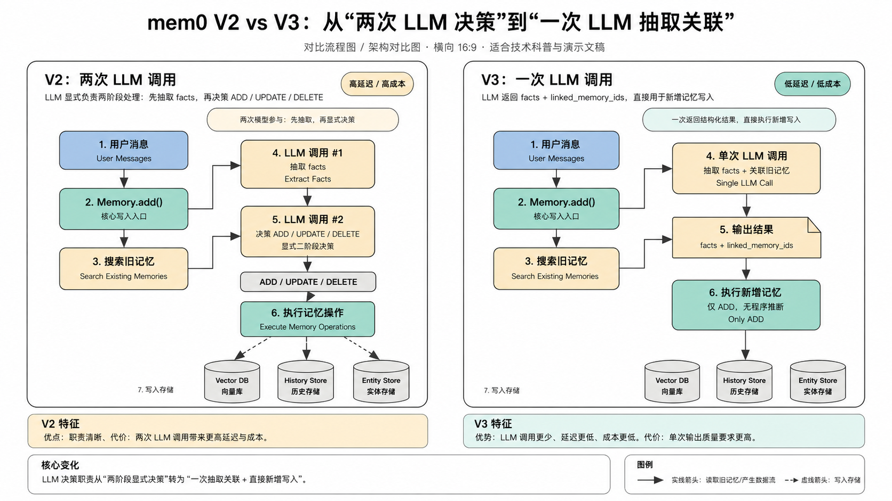

# mem0 参考文章（节选）

> **用途**：展示简洁清晰的技术介绍风格，尤其是"先问题后方案"的行文和对比分析写法。

---

## 前言（完整示例）

mem0 是一个为 AI Agent 和对话助手设计的**智能记忆层**。核心价值是：给 LLM 提供跨会话的持久化、个性化记忆，同时让写入和检索尽量智能、低噪声。

---

## V2 vs V3 对比（横向对比图示例）

V2 和 V3 的差距，表面上看是工程优化，但背后有一个更根本的设计哲学转变：**从"尽量精确地维护记忆"到"尽量保守地积累记忆"**。

- **V2**：让 LLM 全权决定哪些记忆该留、该删、该合并。实践中 LLM 做 DELETE 决策误删率高，代价大。
- **V3**：彻底放弃 DELETE，转为纯 Additive 模式。新事实只能新增或与旧事实合并，真正删除留给用户显式触发。

> **画图提示参考**：白色背景，横向并排对比图。左右各一个米色/奶油色大容器，等宽。左侧顶部"高延迟/高成本"橙色标签，右侧"低延迟/低成本"绿色标签。步骤用数字编号，蓝色圆角起点→薄荷绿过程节点→绿色圆柱存储（向量库/历史存储/实体存储）。左侧两个串行大模型调用节点用黄色高亮，右侧合并为一个大模型节点。底部各有特征说明框，最底部横跨左右的"核心变化"灰底说明框+五色图例（主流程蓝实线/大模型紫实线/存储绿实线/元数据绿虚线/插件橙实线）。

---

## 写作风格要点（从 mem0 文章提炼）

1. **用对比揭示问题**：V2 vs V3 的对比不是功能清单，而是先说旧方案的缺陷，再说新方案怎么解决，读者自然理解为什么要改。

2. **给反直觉的设计解释动机**：V3 不做 DELETE 看起来会导致记忆库膨胀，文章直接承认这点，再解释为什么"误删的代价远高于冗余的代价"。

3. **用表格做清晰对比**：事实提取 vs 程序记忆提取的对比，4个维度一张表，比两段散文清晰得多。

