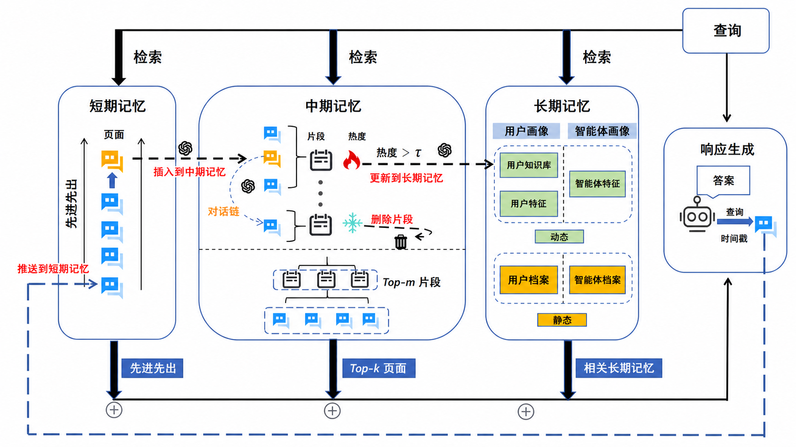

# MemoryOS 参考文章（节选）

> **用途**：这是用本 skill 完成的真实输出样本，可以直接参考其结构、配图提示写法和行文风格。

---

## 整体架构（三层架构图示例）

MemoryOS 的架构直接对应认知科学的记忆分层理论：

| 认知科学 | MemoryOS 实现 | 特点 |
| --- | --- | --- |
| 工作记忆（Working Memory） | 短期记忆 | 容量有限，快速读写，满了即迁移 |
| 情节记忆（Episodic Memory） | 中期记忆 | 主题聚类，热度排序，按需召回 |
| 语义记忆（Semantic Memory） | 长期记忆 | 高度抽象，用户画像 + 结构化知识 |



> **画图提示参考**：白色背景，横向三层架构图（短期记忆/中期记忆/长期记忆），每层用浅蓝大圆角容器+深蓝边框。容器内节点配💬对话气泡图标，中期记忆标🔥热度图标和❄️删除图标，长期记忆分"动态"和"静态"两个区域用黄底小标签区分。层与层之间：橙色虚线箭头向右标"插入到中期记忆"/"更新到长期记忆"，顶部黑色粗箭头向下标"检索"。右侧独立"响应生成"模块（含机器人图标），底部蓝色色块标注各层检索结果类型（先进先出/Top-k页面/相关长期记忆）。

---

## 写入流程（竖向流程图示例）

`add_memory()` 是一个**三阶段级联触发流程**：对话先进短期缓冲，满了再批量迁移到中期，中期热度积累到阈值后触发长期知识提炼。

```
# 画图提示：白色背景，竖向流程图。圆角矩形节点+菱形判断，入口浅蓝，迁移管线橙色，长期记忆更新绿色，判断"否"分支虚线标注"继续等待"。

写入对话（用户输入 + 助手回复）
       │
       ▼
  存入短期缓冲区
       │
       ◇ 是否已满？（≥10条）
       │  否 ─ ─ ─ ─ ─ ─ → 继续等待
       │  是
       ▼
  迁移管线（短期 → 中期）
   ├── 连续性判断（LLM）
   ├── 对话链摘要更新（LLM）
   └── 多主题归纳 → 写入中期记忆
       │
       ◇ 热度最高记忆段 ≥ 5.0？
       │  否 ─ ─ ─ ─ ─ ─ → 继续等待
       │  是
       ▼
  并行触发长期记忆更新：
   ├── 更新用户画像
   └── 写入知识条目
```

---

## 热度机制（折线图示例）

综合热度由三个因子线性叠加：

$$H_{segment} = \alpha \cdot N_{visit} + \beta \cdot L_{interaction} + \gamma \cdot R_{recency}$$

时间衰减因子采用指数衰减，半衰期 24 小时：

$$R_{recency} = e^{-\Delta t / \tau}, \quad \tau = 24\text{ 小时}$$

```
# 画图提示：白色背景，横向折线图。X轴为时间，Y轴为热度值(0~8)，红色虚线标注阈值5.0。橙色折线呈"骤降→缓降→突升→触发"周期波形，关键转折点标注中文事件（创建即触发长期记忆/热度重置/被检索命中/再次触发长期记忆）。

刚创建（含5条对话）：
  热度 = 命中0次 + 对话5条 + 时间新鲜1.0 = 6.0   ← 超过阈值，触发长期记忆更新
更新后重置：
  热度 ≈ 0 + 0 + 1.0 = 1.0                      ← 低于阈值，重新积累
24小时后：热度 = 0.368
用户提问命中：命中次数+1，访问时间重置
  热度 = 1 + 0 + 1.0 = 2.0                       ← 热度回升
再写入5条新对话：对话数+5
  热度 = 1 + 5 + 1.0 = 7.0                       ← 再次触发长期记忆更新
```

