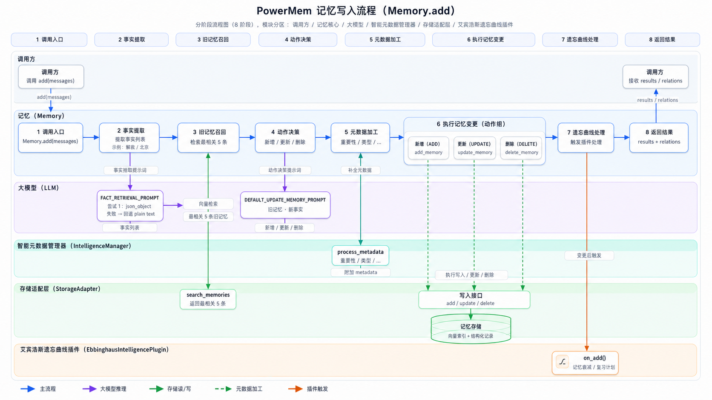
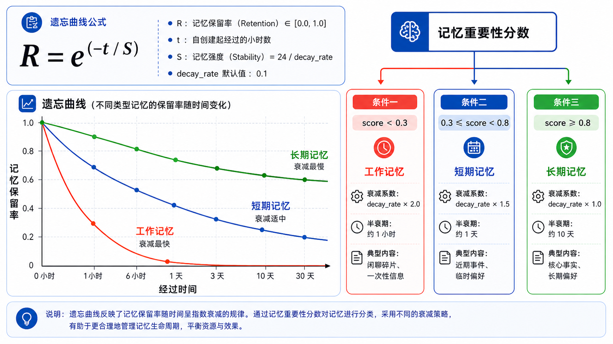

# PowerMem 参考文章（节选）

> **用途**：这是一篇高质量的技术介绍文章样本，展示了本 skill 要求的完整写作风格。
> 重点关注：前言结构、画图提示的写法、先问题后方案的行文方式。

---

## 前言（完整示例）

PowerMem 是一个为 AI Agent 设计的**持久化智能记忆层**。核心价值是：用 Ebbinghaus 遗忘曲线管理记忆生命周期，用混合搜索实现高质量召回，让 AI 真正具备"跨会话长期记忆"的能力。

一句话概括：**它不是向量数据库，而是让记忆像人类一样会遗忘、会强化、会压缩的 AI 第二大脑。**

| 维度          | PowerMem   | 全量上下文 | 提升幅度   |
| ------------- | ---------- | ---------- | ---------- |
| 准确率        | **78.70%** | 52.9%      | +48.8%     |
| 检索 p95 延迟 | **1.44s**  | 17.12s     | 11.9× 更快 |
| Token 用量    | **~0.9k**  | ~26k       | 28.9× 更少 |

- **写入侧**的核心问题是：**原始对话不能直接存**。用户输入充满噪声、重复、矛盾，直接存向量库只会让记忆库越堆越乱。PowerMem 的解法是用 LLM 先提炼出结构化事实，再通过四类决策事件（ADD/UPDATE/DELETE/NONE）精确地管理每条记忆的生死。
- **检索侧**的核心问题是：**单路向量搜索召回不全**。专有名词在向量空间容易被稀释。PowerMem 的解法是三路混合搜索（dense 向量 + 全文 + sparse 向量），叠加 Reranker 精排，再用 Ebbinghaus 遗忘分数做最终加权。

---

## 写入流程（配图示例）

PowerMem 的 `add()` 是一个 **LLM 驱动的语义提炼流程**，而不是简单的"写入向量库"。下图是完整的写入链路：

> **画图提示参考**：白色背景，横向多泳道流程图，顶部有8个阶段编号栏（浅灰背景）。5条泳道从上到下：调用方（白色）/ 记忆核心（浅蓝）/ 大模型（浅紫）/ 智能元数据管理器（浅绿）/ 存储适配层（极浅绿）/ 遗忘曲线插件（极浅橙）。圆角矩形节点，深色标题+浅色副标题说明。箭头颜色：主流程蓝色实线、大模型推理紫色实线、存储读写绿色实线、元数据加工绿色虚线、插件触发橙色实线。底部附五色图例。

---

## 关键设计：遗忘曲线（公式+分级卡片配图示例）

根据 Ebbinghaus 提出的遗忘曲线，核心数学公式如下：

$$R = e^{-\frac{t}{S}}$$

| 变量 | 名称 | 说明 |
| :--: | :--- | :--- |
| $R$ | 记忆保留率 | 取值 $[0.0, 1.0]$，当前记忆留存比例 |
| $t$ | 经过时间 | 自记忆创建起所经过的小时数 |
| $S$ | 记忆强度 | $S = 24 / \text{decay\_rate}$，值越大遗忘越慢 |

> **画图提示参考**：白色背景，左右分栏布局。左侧：大号公式（R=e^(-t/S)）+ 三色折线图，红色=工作记忆（衰减最快），蓝色=短期记忆，绿色=长期记忆（衰减最慢），X轴"经过时间"（0到30天），Y轴"记忆保留率"（0~1.0）。右侧：标题"记忆重要性分数"，三张条件卡片并排，红框浅红背景（score<0.3，工作记忆，衰减系数×2.0，半衰期约1小时），蓝框浅蓝背景（0.3≤score<0.8，短期记忆），绿框浅绿背景（score≥0.8，长期记忆，半衰期约10天）。每卡含条件标题+图标+三行参数。底部浅灰说明框。

